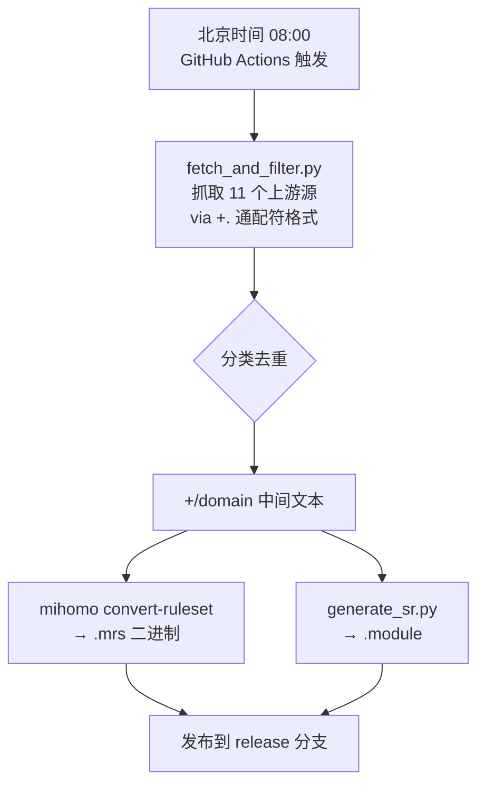

# ProxyRules

自动化代理路由规则订阅仓库，以 [MetaCubeX/meta-rules-dat](https://github.com/MetaCubeX/meta-rules-dat) 为基础，整合 11 个上游规则源，清洗去重后发布为 Mihomo MRS 二进制规则集和 Shadowrocket 模块。

规则采用 Mihomo 官方 `+.domain` 通配符语法，等价于 `DOMAIN-SUFFIX`。

> **注意：本项目规则仅适用于白名单模式。**

## 功能概览

| 产物 | 格式 | 说明 |
|------|------|------|
| `direct_domain.mrs` | MRS 二进制 | 中国大陆域名 |
| `direct_ip.mrs` | MRS 二进制 | 中国大陆公网 IP 段 |
| `private_ip.mrs` | MRS 二进制 | 局域网/私有/保留 IP 段 |
| `private_domain.mrs` | MRS 二进制 | 局域网专用域名 |
| `reject.mrs` | MRS 二进制 | 广告/追踪/统计域名拦截 |
| `Shadowrocket/direct.module` | Surge 模块 | Shadowrocket 直连模块 |
| `Shadowrocket/reject.module` | Surge 模块 | Shadowrocket 拦截模块 |

- 最后更新时间：2026-07-06 09:29:44
- DIRECT 规则数：116687，update +94
- REJECT 规则数：475773，update -732

## 订阅地址

### MRS 二进制规则（Mihomo 高效格式）

```
https://raw.githubusercontent.com/EastonSun/ProxyRules/release/direct_domain.mrs
https://raw.githubusercontent.com/EastonSun/ProxyRules/release/direct_ip.mrs
https://raw.githubusercontent.com/EastonSun/ProxyRules/release/private_ip.mrs
https://raw.githubusercontent.com/EastonSun/ProxyRules/release/private_domain.mrs
https://raw.githubusercontent.com/EastonSun/ProxyRules/release/reject.mrs
```

### Shadowrocket 模块

```
https://raw.githubusercontent.com/EastonSun/ProxyRules/release/Shadowrocket/direct.module
https://raw.githubusercontent.com/EastonSun/ProxyRules/release/Shadowrocket/reject.module
```

## 使用方法
### Mihomo

```yaml
rules:
  - RULE-SET,adblock,reject
  - RULE-SET,geosite-private,direct
  - RULE-SET,geoip-private,direct,no-resolve
  - RULE-SET,geosite-cn,direct
  - RULE-SET,geoip-cn,direct,no-resolve
  - MATCH,PROXY

rule-providers:
  geosite-private:
    type: http
    path: geosite-private.mrs
    url: "https://raw.githubusercontent.com/EastonSun/ProxyRules/release/private_domain.mrs"
    interval: 86400
    proxy: PROXY
    behavior: domain
    format: mrs

  geoip-private:
    type: http
    path: geoip-private.mrs
    url: "https://raw.githubusercontent.com/EastonSun/ProxyRules/release/private_ip.mrs"
    interval: 86400
    proxy: PROXY
    behavior: ipcidr
    format: mrs

  geosite-cn:
    type: http
    path: geosite-cn.mrs
    url: "https://raw.githubusercontent.com/EastonSun/ProxyRules/release/direct_domain.mrs"
    interval: 86400
    proxy: PROXY
    behavior: domain
    format: mrs

  geoip-cn:
    type: http
    path: geoip-cn.mrs
    url: "https://raw.githubusercontent.com/EastonSun/ProxyRules/release/direct_ip.mrs"
    interval: 86400
    proxy: PROXY
    behavior: ipcidr
    format: mrs

  adblock:
    type: http
    path: adblock.mrs
    url: "https://raw.githubusercontent.com/EastonSun/ProxyRules/release/reject.mrs"
    interval: 86400
    proxy: PROXY
    behavior: domain
    format: mrs
```
### Shadowrocket<br/>
[使用方法](https://github.com/GMOogway/shadowrocket-rules#%E4%BD%BF%E7%94%A8%E6%96%B9%E6%B3%95)

## 上游数据源

本仓库以 MetaCubeX/meta-rules-dat 为核心基础，结合以下社区规则数据（排名不分先后）：

| 上游源 | 用途 |
|--------|------|
| [MetaCubeX/meta-rules-dat](https://github.com/MetaCubeX/meta-rules-dat) | **核心基础** — Mihomo 官方生态规则 |
| [Loyalsoldier/clash-rules](https://github.com/Loyalsoldier/clash-rules) | 直连域名、大陆 IP、广告拦截、私有 IP |
| [Loyalsoldier/v2ray-rules-dat](https://github.com/Loyalsoldier/v2ray-rules-dat) | 增强版直连域名、广告拦截 |
| [xkww3n/Rules](https://github.com/xkww3n/Rules) | 中日广告过滤、国内域名 |
| [ACL4SSR/ACL4SSR](https://github.com/ACL4SSR/ACL4SSR) | 经典中国域名与广告拦截 |
| [Cats-Team/AdRules](https://github.com/Cats-Team/AdRules) | 中国区广告规则合集 |
| [zqzess/rule_for_quantumultX](https://github.com/zqzess/rule_for_quantumultX) | 海量广告域名 |
| [blackmatrix7/ios_rule_script](https://github.com/blackmatrix7/ios_rule_script) | 全面按服务细分的规则库 |
| [felixonmars/dnsmasq-china-list](https://github.com/felixonmars/dnsmasq-china-list) | 中国域名白名单 |
| [gaoyifan/china-operator-ip](https://github.com/gaoyifan/china-operator-ip) | 中国运营商 IP 段 |
| [REIJI007/AdBlock_Rule_For_Clash](https://github.com/REIJI007/AdBlock_Rule_For_Clash) | 广告域名拦截规则集 |

## 自动化流水线



## 手动自定义规则

仓库提供四个手动干预文件，你可以直接修改后提交，下次构建时自动生效：

| 文件 | 作用 |
|------|------|
| `config/add_direct.txt` | 追加直连域名（一行一个） |
| `config/remove_direct.txt` | 从直连名单中删除（一行一个） |
| `config/add_reject.txt` | 追加拦截域名 |
| `config/remove_reject.txt` | 从拦截名单中删除 |

## 本地运行

```bash
# 1. 创建虚拟环境
python3 -m venv .venv
source .venv/bin/activate

# 2. 安装依赖
pip install -r scripts/requirements.txt

# 3. 抓取并清洗规则（生成中间文本，使用 +. 通配符格式）
python scripts/fetch_and_filter.py

# 4. 编译 Mihomo MRS 二进制（需要本地安装 mihomo）
python scripts/compile_mihomo.py

# 5. 生成 Shadowrocket 模块
python scripts/generate_sr.py
```

## 发布流程

1. Fork 本仓库
2. 创建一个空的 `release` 分支：`git checkout --orphan release && git commit --allow-empty -m "init" && git push origin release`
3. 在 Settings → Actions → Workflow permissions 中选择 **Read and write permissions**
4. 手动触发一次 Actions（`workflow_dispatch`）验证
5. 后续每天北京时间 08:00 自动更新

## 许可

MIT License
