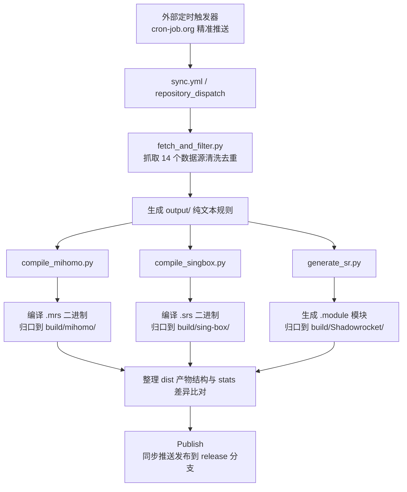

# ProxyRules

自动化代理路由规则订阅仓库，以 [MetaCubeX/meta-rules-dat](https://github.com/MetaCubeX/meta-rules-dat) 为基础，整合 14 个上游规则源，清洗去重后发布为 Mihomo MRS 二进制规则集、Sing-box SRS 二进制规则集和 Shadowrocket 模块。

> **注意：本项目规则仅适用于白名单分流模式（或科学上网黑名单分流）。**

## 功能概览

| 客户端与路径 | 规则类型 | 说明 | 格式 |
|------|------|------|------|
| `mihomo/direct_domain.mrs` | 直连分流 | 中国大陆直连域名与大厂 CDN | MRS 二进制 |
| `mihomo/direct_ip.mrs` | 直连分流 | 中国大陆公网 IP 段 | MRS 二进制 |
| `mihomo/private_domain.mrs` | 直连分流 | 局域网专用域名 | MRS 二进制 |
| `mihomo/private_ip.mrs` | 直连分流 | 局域网/私有/保留 IP 段 | MRS 二进制 |
| `mihomo/reject_domain.mrs` | 拦截分流 | 广告/追踪/统计/HttpDNS 拦截域名 | MRS 二进制 |
| `mihomo/reject_ip.mrs` | 拦截分流 | 广告/追踪/HttpDNS 拦截 IP-CIDR | MRS 二进制 |
| `mihomo/no_cn_domain.mrs` | 代理分流 | 非中国大陆域名/需要代理访问的国外域名 | MRS 二进制 |
| `sing-box/direct_domain.srs` | 直连分流 | 中国大陆直连域名与大厂 CDN | SRS 二进制 |
| `sing-box/direct_ip.srs` | 直连分流 | 中国大陆公网 IP 段 | SRS 二进制 |
| `sing-box/private_domain.srs` | 直连分流 | 局域网专用域名 | SRS 二进制 |
| `sing-box/private_ip.srs` | 直连分流 | 局域网/私有/保留 IP 段 | SRS 二进制 |
| `sing-box/reject_domain.srs` | 拦截分流 | 广告/追踪/统计/HttpDNS 拦截域名 | SRS 二进制 |
| `sing-box/reject_ip.srs` | 拦截分流 | 广告/追踪/HttpDNS 拦截 IP-CIDR | SRS 二进制 |
| `sing-box/no_cn_domain.srs` | 代理分流 | 非中国大陆域名/需要代理访问的国外域名 | SRS 二进制 |
| `Shadowrocket/direct.module` | 直连分流 | Shadowrocket 大陆域名 + IP 直连模块 | Surge 模块 |
| `Shadowrocket/reject.module` | 拦截分流 | Shadowrocket 广告/追踪拦截模块 | Surge 模块 |
| `Shadowrocket/proxy.module` | 代理分流 | Shadowrocket 代理域名与国外服务模块 | Surge 模块 |

- 最后更新时间：2026-08-05 08:02:55
- DIRECT_DOMAIN 规则数：116401，update +2
- DIRECT_IP 规则数：23575，update +2
- REJECT_DOMAIN 规则数：576836，update +106
- REJECT_IP 规则数：512，update +0
- NO_CN_DOMAIN 规则数：28919，update +14

---

## 订阅地址

所有规则文件均存放在 `release` 分支下的对应子文件夹内。

### 1. Mihomo MRS 二进制规则集（高效专有格式）
```text
https://raw.githubusercontent.com/EastonSun/ProxyRules/release/mihomo/direct_domain.mrs
https://raw.githubusercontent.com/EastonSun/ProxyRules/release/mihomo/direct_ip.mrs
https://raw.githubusercontent.com/EastonSun/ProxyRules/release/mihomo/private_domain.mrs
https://raw.githubusercontent.com/EastonSun/ProxyRules/release/mihomo/private_ip.mrs
https://raw.githubusercontent.com/EastonSun/ProxyRules/release/mihomo/reject_domain.mrs
https://raw.githubusercontent.com/EastonSun/ProxyRules/release/mihomo/reject_ip.mrs
https://raw.githubusercontent.com/EastonSun/ProxyRules/release/mihomo/no_cn_domain.mrs
```

### 2. Sing-box SRS 二进制规则集（高效专有格式）
```text
https://raw.githubusercontent.com/EastonSun/ProxyRules/release/sing-box/direct_domain.srs
https://raw.githubusercontent.com/EastonSun/ProxyRules/release/sing-box/direct_ip.srs
https://raw.githubusercontent.com/EastonSun/ProxyRules/release/sing-box/private_domain.srs
https://raw.githubusercontent.com/EastonSun/ProxyRules/release/sing-box/private_ip.srs
https://raw.githubusercontent.com/EastonSun/ProxyRules/release/sing-box/reject_domain.srs
https://raw.githubusercontent.com/EastonSun/ProxyRules/release/sing-box/reject_ip.srs
https://raw.githubusercontent.com/EastonSun/ProxyRules/release/sing-box/no_cn_domain.srs
```

### 3. Shadowrocket 订阅模块
```text
https://raw.githubusercontent.com/EastonSun/ProxyRules/release/Shadowrocket/direct.module
https://raw.githubusercontent.com/EastonSun/ProxyRules/release/Shadowrocket/reject.module
https://raw.githubusercontent.com/EastonSun/ProxyRules/release/Shadowrocket/proxy.module
```

---

## 使用方法

### 1. Mihomo (Clash Meta)
```yaml
rules:
  - RULE-SET,adblock,reject
  - RULE-SET,adblock-ip,reject
  - RULE-SET,geosite-private,direct
  - RULE-SET,geoip-private,direct,no-resolve
  - RULE-SET,proxy-list,PROXY              # 非大陆域名走代理
  - RULE-SET,geosite-cn,direct
  - RULE-SET,geoip-cn,direct,no-resolve
  - MATCH,PROXY                            # 兜底：所有其他流量走代理

rule-providers:
  geosite-private:
    type: http
    path: geosite-private.mrs
    url: "https://raw.githubusercontent.com/EastonSun/ProxyRules/release/mihomo/private_domain.mrs"
    interval: 86400
    behavior: domain
    format: mrs

  geoip-private:
    type: http
    path: geoip-private.mrs
    url: "https://raw.githubusercontent.com/EastonSun/ProxyRules/release/mihomo/private_ip.mrs"
    interval: 86400
    behavior: ipcidr
    format: mrs

  geosite-cn:
    type: http
    path: geosite-cn.mrs
    url: "https://raw.githubusercontent.com/EastonSun/ProxyRules/release/mihomo/direct_domain.mrs"
    interval: 86400
    behavior: domain
    format: mrs

  geoip-cn:
    type: http
    path: geoip-cn.mrs
    url: "https://raw.githubusercontent.com/EastonSun/ProxyRules/release/mihomo/direct_ip.mrs"
    interval: 86400
    behavior: ipcidr
    format: mrs

  adblock:
    type: http
    path: adblock.mrs
    url: "https://raw.githubusercontent.com/EastonSun/ProxyRules/release/mihomo/reject_domain.mrs"
    interval: 86400
    behavior: domain
    format: mrs

  adblock-ip:
    type: http
    path: adblock-ip.mrs
    url: "https://raw.githubusercontent.com/EastonSun/ProxyRules/release/mihomo/reject_ip.mrs"
    interval: 86400
    behavior: ipcidr
    format: mrs

  proxy-list:
    type: http
    path: proxy-list.mrs
    url: "https://raw.githubusercontent.com/EastonSun/ProxyRules/release/mihomo/no_cn_domain.mrs"
    interval: 86400
    behavior: domain
    format: mrs
```

### 2. Sing-box
在 sing-box 的 `route.rule_set` 中配置：
```json
{
  "route": {
    "rules": [
      {
        "rule_set": "reject-domain",
        "action": "reject"
      },
      {
        "rule_set": "reject-ip",
        "action": "reject"
      },
      {
        "rule_set": [
          "private-domain",
          "private-ip",
          "direct-domain",
          "direct-ip"
        ],
        "action": "direct"
      },
      {
        "rule_set": "proxy-domain",
        "action": "hijack-to-proxy"
      }
    ],
    "rule_set": [
      {
        "tag": "private-domain",
        "type": "remote",
        "format": "binary",
        "url": "https://raw.githubusercontent.com/EastonSun/ProxyRules/release/sing-box/private_domain.srs",
        "download_detour": "PROXY"
      },
      {
        "tag": "private-ip",
        "type": "remote",
        "format": "binary",
        "url": "https://raw.githubusercontent.com/EastonSun/ProxyRules/release/sing-box/private_ip.srs",
        "download_detour": "PROXY"
      },
      {
        "tag": "direct-domain",
        "type": "remote",
        "format": "binary",
        "url": "https://raw.githubusercontent.com/EastonSun/ProxyRules/release/sing-box/direct_domain.srs",
        "download_detour": "PROXY"
      },
      {
        "tag": "direct-ip",
        "type": "remote",
        "format": "binary",
        "url": "https://raw.githubusercontent.com/EastonSun/ProxyRules/release/sing-box/direct_ip.srs",
        "download_detour": "PROXY"
      },
      {
        "tag": "reject-domain",
        "type": "remote",
        "format": "binary",
        "url": "https://raw.githubusercontent.com/EastonSun/ProxyRules/release/sing-box/reject_domain.srs",
        "download_detour": "PROXY"
      },
      {
        "tag": "reject-ip",
        "type": "remote",
        "format": "binary",
        "url": "https://raw.githubusercontent.com/EastonSun/ProxyRules/release/sing-box/reject_ip.srs",
        "download_detour": "PROXY"
      },
      {
        "tag": "proxy-domain",
        "type": "remote",
        "format": "binary",
        "url": "https://raw.githubusercontent.com/EastonSun/ProxyRules/release/sing-box/no_cn_domain.srs",
        "download_detour": "PROXY"
      }
    ]
  }
}
```

### 3. Shadowrocket
[Shadowrocket Surge 模块使用方法](https://github.com/GMOogway/shadowrocket-rules#%E4%BD%BF%E7%94%A8%E6%96%B9%E6%B3%95)

---

## 上游数据源

本仓库以 MetaCubeX/meta-rules-dat 为核心基础，结合以下社区规则数据：

| 上游源 | 用途 |
|--------|------|
| [MetaCubeX/meta-rules-dat](https://github.com/MetaCubeX/meta-rules-dat) | **核心基础** — Mihomo 官方生态规则 |
| [Loyalsoldier/clash-rules](https://github.com/Loyalsoldier/clash-rules) | 直连域名、大陆 IP、广告拦截、私有 IP、非大陆及代理域名 |
| [Loyalsoldier/v2ray-rules-dat](https://github.com/Loyalsoldier/v2ray-rules-dat) | 增强版直连域名、广告拦截、非大陆代理域名 |
| [xkww3n/Rules](https://github.com/xkww3n/Rules) | 中日广告过滤、国内域名 |
| [ACL4SSR/ACL4SSR](https://github.com/ACL4SSR/ACL4SSR) | 经典中国域名与广告拦截 |
| [Cats-Team/AdRules](https://github.com/Cats-Team/AdRules) | 中国区广告规则合集 |
| [zqzess/rule_for_quantumultX](https://github.com/zqzess/rule_for_quantumultX) | 海量广告域名 |
| [blackmatrix7/ios_rule_script](https://github.com/blackmatrix7/ios_rule_script) | 全面按服务细分的规则库 |
| [felixonmars/dnsmasq-china-list](https://github.com/felixonmars/dnsmasq-china-list) | 中国域名白名单 |
| [gaoyifan/china-operator-ip](https://github.com/gaoyifan/china-operator-ip) | 中国运营商 IP 段 |
| [REIJI007/AdBlock_Rule_For_Clash](https://github.com/REIJI007/AdBlock_Rule_For_Clash) | 广告域名拦截规则集 |
| [v2fly/domain-list-community](https://github.com/v2fly/domain-list-community) | V2Fly 社区域名列表 — 中国域名白名单原始数据 |
| [privacy-protection-tools/anti-AD](https://github.com/privacy-protection-tools/anti-AD) | 中文区广告过滤列表 (~98,000+ 条) |
| [17mon/china_ip_list](https://github.com/17mon/china_ip_list) | 中国 IP 地址段 (ipip.net 数据) |

---

## 自动化流水线


```mermaid
graph TD
    A[外部定时触发器<br/>cron-job.org 精准推送] --> B[sync.yml / repository_dispatch]
    B --> C[fetch_and_filter.py<br/>抓取 14 个数据源清洗去重]
    C --> D[生成 output/ 纯文本规则]
    
    D --> E[compile_mihomo.py]
    D --> F[compile_singbox.py]
    D --> G[generate_sr.py]
    
    E --> H[编译 .mrs 二进制<br/>归口到 build/mihomo/]
    F --> I[编译 .srs 二进制<br/>归口到 build/sing-box/]
    G --> J[生成 .module 模块<br/>归口到 build/Shadowrocket/]
    
    H & I & J --> K[整理 dist 产物结构与 stats 差异比对]
    K --> L[Publish<br/>同步推送发布到 release 分支]
```

---

## 手动自定义规则

仓库提供十个手动干预文件，你可以直接修改后提交，下次构建时自动生效：

| 文件 | 作用 |
|------|------|
| `config/add_direct_domain.txt` | 追加直连域名（一行一个） |
| `config/remove_direct_domain.txt` | 从直连域名名单中删除（一行一个） |
| `config/add_direct_ip.txt` | 追加直连 IP-CIDR（一行一个） |
| `config/remove_direct_ip.txt` | 从直连 IP-CIDR 名单中删除（一行一个） |
| `config/add_reject_domain.txt` | 追加拦截域名 |
| `config/remove_reject_domain.txt` | 从拦截域名名单中删除 |
| `config/add_reject_ip.txt` | 追加拦截 IP-CIDR |
| `config/remove_reject_ip.txt` | 从拦截 IP-CIDR 名单中删除 |
| `config/add_no_cn_domain.txt` | 追加代理/非大陆域名 |
| `config/remove_no_cn_domain.txt` | 从代理/非大陆域名名单中删除 |

---

## 本地运行

```bash
# 1. 创建并激活虚拟环境
python3 -m venv .venv
source .venv/bin/activate

# 2. 安装依赖
pip install -r scripts/requirements.txt

# 3. 抓取并清洗规则（生成中间文本）
python scripts/fetch_and_filter.py

# 4. 编译 Mihomo MRS 二进制（需要本地安装 mihomo）
python scripts/compile_mihomo.py

# 5. 编译 Sing-box SRS 二进制（需要本地安装 sing-box，脚本亦支持自动缓存）
python scripts/compile_singbox.py

# 6. 生成 Shadowrocket 模块
python scripts/generate_sr.py
```

---

## 发布流程

1. Fork 本仓库。
2. 创建一个空的 `release` 分支：
   ```bash
   git checkout --orphan release
   git commit --allow-empty -m "init"
   git push origin release
   ```
3. 在 Settings → Actions → Workflow permissions 中勾选 **Read and write permissions**。
4. 在 Settings → Developer settings → Personal access tokens 处生成一个经典 Token（需要 `repo` 权限，供 `cron-job.org` 调用）。
5. 注册并登录 [cron-job.org](https://cron-job.org/)，创建一个定时任务：
   * **URL**: `https://api.github.com/repos/{您的用户名}/{您的仓库名}/dispatches`
   * **Method**: `POST`
   * **Headers**:
     * `Accept`: `application/vnd.github+json`
     * `Authorization`: `Bearer {您的经典 Token}`
     * `User-Agent`: `cron-job.org`
   * **Request body (JSON)**:
     ```json
     {
       "event_type": "cron_sync"
     }
     ```
   * **Schedule**: 配置您心仪的每日运行时间。
6. 手动在 GitHub Actions 页面触发一次 `sync.yml`（通过 `workflow_dispatch`），即可立即看到全客户端分流二进制包发布。

## 许可

[MIT License](LICENSE)
